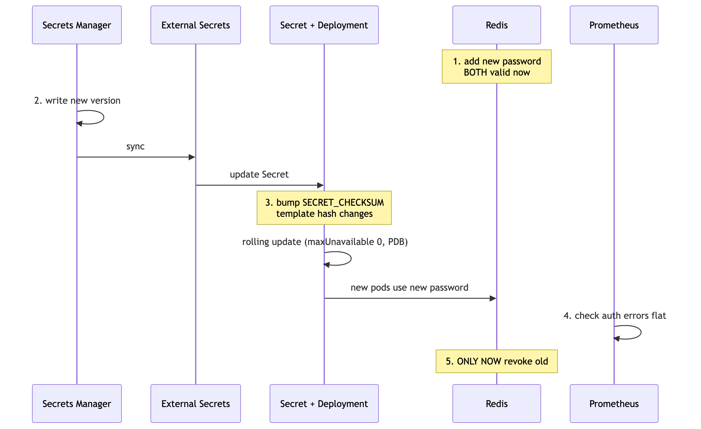

# DESIGN.md

~50M requests/day, ~2,000 req/s burst, one Deployment on CPU-based HPA.
Running on AWS/EKS. Same primitives on GKE - only node pools vs managed node
groups differ.

## 1. Cutting scale-out from 90s to under 20s

The 90s is three delays stacked, not one:

| Stage | Cost | HPA tuning helps? |
|---|---|---|
| metrics scrape + HPA sync | 15–30s | partly |
| `scaleUp` stabilization | 300s default | yes - already `0s` in our chart |
| schedule + pull + boot + Ready | 30–60s | no |

Tuning fixes the middle row only. The rest has to come from reacting earlier and
booting faster.

**Scale on RPS, not CPU.** CPU only rises *after* requests queue, so a CPU HPA is
always late. 

KEDA with a Prometheus scaler fixes this - it watches request rate directly and polls every 5s. Keep the CPU HPA as a fallback

→ Costs: one more operator to run and upgrade, and it becomes a dependency of
autoscaling itself.  We'll also need to replace our `HorizontalPodAutoscaler` with a `ScaledObject` - can't have both controllers fighting over the same Deployment.

**Keep spare capacity.** Drop `targetCPUUtilizationPercentage` below the 60% we
ship, or raise `minReplicas` past 3. Running pods then soak up the burst while new
ones start. Cheapest fix that actually works; you pay for idle pods.

**Pre-warm with pause pods.** Low-priority placeholders that real pods evict. Turns
scale-out into scheduling instead of waiting 1–2 min for a new node.

**Boot faster.** Pre-pull images, keep the readiness check shallow, and tighten
`startupProbe` to the real boot time (we currently allow 30s)

**Metrics:** trigger on RPS per pod or in-flight requests. Guard with p99, 5xx, and
`redis_connection_errors`. Also track time-to-Ready to catch any startup regressions.

**Watch out:** the same scenario mentions Redis connections spiking, and scaling out
makes that worse - `maxConnections: 100` × 20 replicas = 2,000 connections. If we fix the lag without capping the pool, we just shift the failure to Redis.

**Trade-off:** a 0s stabilization window can thrash on spiky traffic; our 600s
`scaleDown` window damps that. Sub-20s is something you buy, not something you tune
for free.

## 2. Isolating from Noisy Neighbours

Cheapest first:

1. **Requests and limits.** Equal memory request and limit makes the pod
   Guaranteed-class, so it's evicted last. There's a tension we flagged in the chart: CPU *limits* cause throttling and p99 spikes - but if we're isolating from noisy neighbours, that's a trade-off worth making.
2. **`priorityClassName`** (`platform-high`) decides who gets evicted under
   pressure, not who gets CPU. Analytics should lose.
   `topologySpreadConstraints` limit blast radius, not contention.
   `ResourceQuota` stops one namespace eating the cluster.
3. **Taints, tolerations, `nodeSelector`** - For stronger placement isolation, use taints/tolerations plus node affinity. For example, label data-sync nodes with `workload=data-sync`, taint them with `dedicated=data-sync:NoSchedule`, and configure data-sync to tolerate the taint and require the node label. ClickHouse would not have that toleration, preventing it from landing on those nodes.

**When to go dedicated node pool:** I would move to a dedicated node pool when latency SLOs must hold under worst-case contention, when data-sync and ClickHouse require substantially different instance types, or when tenancy requirements demand hard isolation. The cost is reduced bin-packing efficiency and potentially more idle capacity.

## 3. Rotating REDIS_PASSWORD every 90 days

The password is currently delivered as an environment variable, which is read when the container starts. Updating the Kubernetes Secret therefore does not change credentials in running pods. I would use a controlled rolling restart and it works with what we ship today.

*If you want no restarts at all:* mount the Secret as a file (kubelet updates it in
place) and reload on SIGHUP. That's an app change, not a manifest one.

**The part that actually matters: Redis has to accept both passwords during the
switch.** Otherwise there's a guaranteed window where pods fail auth. Redis 6+ ACLs
allow two passwords per user; ElastiCache has two-auth-token rotation for this.

`SECRET_CHECKSUM` in our Kustomize overlay drives step 3 - changing that annotation
changes the pod-template hash, which makes the Deployment do a normal rolling
update. It's also why the chart hashes the ConfigMap but *not* the Secret: an
automatic secret hash would turn every credential write into an instant
uncontrolled rollout.

**Verifying - "pods are Running" isn't enough.** A pod can be Running and Ready
while failing Redis auth, because `/health` doesn't check Redis. So: watch
`redis_connection_errors` stay flat, confirm p99 and 5xx don't move, and check every
pod is on the new template hash *before* revoking.

Automate the 90-day cycle in CD, but gate the revoke step on that verification
rather than a timer.
